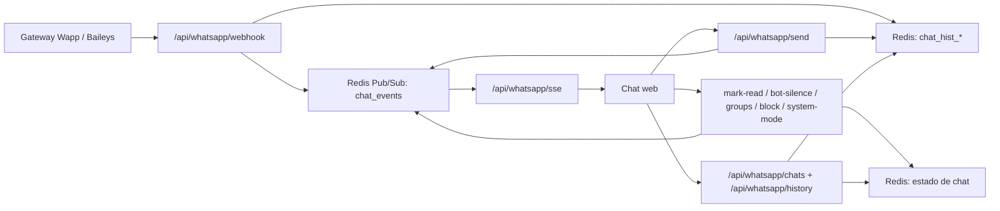

# Chat web en tiempo real con SSE

Esta seccion documenta el flujo actual del chat web tipo WhatsApp. El proyecto no usa Meta API; los mensajes salen y entran por el gateway Wapp/Baileys y la UI se sincroniza con Server-Sent Events (SSE).

## Objetivo

- Evitar polling de lista de chats y mensajes.
- Reducir ancho de banda y lecturas repetitivas a Redis.
- Mantener varias pestanas del dashboard sincronizadas en tiempo real.
- Evitar perdida de eventos cuando llegan mensajes, ACKs o cambios de estado muy juntos.

## Arquitectura



## Flujo del frontend

El archivo principal es `src/app/chat/page.js`.

- Al cargar la pagina se hace una sincronizacion inicial con `/api/whatsapp/chats`.
- Al abrir un chat se carga `/api/whatsapp/history?phone=...`.
- Despues de eso, no hay intervalos de polling para lista ni mensajes.
- La UI abre `EventSource('/api/whatsapp/sse')`.
- Cada evento `chat:update` dispara:
  - refresco de lista de chats, con debounce corto de 80 ms;
  - refresco del historial solo si el evento corresponde al chat activo;
  - actualizacion local del modo online/offline cuando el evento trae `reason: "system-mode"`.
- Al volver a una pestana visible se hace una sincronizacion unica para cubrir pausas del navegador.

El unico `setInterval` relacionado con SSE es un heartbeat de servidor cada 20 segundos para mantener viva la conexion; no consulta datos.

## Canal de eventos

El helper central esta en `src/lib/realtime.js`.

```js
publishChatEvent({ phone, redisPhone, reason })
```

Publica en:

- `chat_events`: canal Redis Pub/Sub usado por SSE.
- `sse_notify_last`: ultimo evento para diagnostico rapido.

Campos:

- `type`: actualmente `chat:update`.
- `ts`: timestamp del evento.
- `phone`: identificador visible del chat. Puede ser telefono normal o JID de grupo.
- `redisPhone`: identificador normalizado usado para Redis cuando aplica.
- `reason`: origen del evento.

## Productores de eventos

Estos endpoints publican eventos en `chat_events`:

- `src/app/api/whatsapp/webhook/route.js`
  - mensajes entrantes;
  - mensajes de grupos;
  - respuestas automaticas del bot;
  - ACKs de entrega/lectura;
  - typing/presence;
  - pedidos de catalogo.
- `src/app/api/whatsapp/send/route.js`
  - mensajes manuales enviados desde la UI.
- `src/app/api/whatsapp/mark-read/route.js`
  - marcar como leido/no leido.
- `src/app/api/whatsapp/bot-silence/route.js`
  - silenciar/reactivar bot.
- `src/app/api/whatsapp/groups/route.js`
  - fijar, renombrar o desfijar grupos.
- `src/app/api/whatsapp/block/route.js`
  - bloquear/desbloquear contacto.
- `src/app/api/whatsapp/create-chat/route.js`
  - crear chat manual.
- `src/app/api/whatsapp/system-mode/route.js`
  - modo online/offline.

## SSE backend

El endpoint `src/app/api/whatsapp/sse/route.js`:

- corre en runtime Node.js;
- se suscribe a `chat_events`;
- envia cada mensaje Pub/Sub como evento SSE;
- envia heartbeats `: keepalive` cada 20 segundos;
- cierra la suscripcion Redis cuando el navegador aborta la conexion.

## Redis requerido

Para tiempo real completo se necesita `REDIS_URL` con soporte Pub/Sub.

El cliente `src/lib/redis.js` expone:

- `publish(channel, value)`;
- `subscribe(channel, onMessage)`.

Si se usa KV REST sin Pub/Sub, el build no falla, pero la conexion SSE no recibira eventos reales. En produccion debe configurarse un Redis compatible con Pub/Sub.

## Diagnostico rapido

1. Abrir `/chat` y confirmar que existe una conexion `EventSource` a `/api/whatsapp/sse`.
2. Enviar un mensaje desde el gateway o desde la UI.
3. Revisar que `sse_notify_last` cambie en Redis.
4. Si `sse_notify_last` cambia pero la UI no refresca, revisar `/api/whatsapp/sse`.
5. Si `sse_notify_last` no cambia, revisar el endpoint productor del evento.
6. Si grupos no refrescan, revisar que el evento incluya `phone` con JID y `redisPhone` normalizado.

## Verificacion antes de deploy

```bash
npm run build
```

`npm run lint` actualmente tiene deuda fuera del cambio SSE:

- `src/app/promociones/page.js`: comillas sin escapar.
- `src/components/Sidebar.js`: regla React Compiler sobre `setState` en efecto.
- `temp.js`: error de parseo.

La seccion de chat puede mostrar warnings por ``, pero no errores bloqueantes del cambio SSE.
